# 地名标签云可视化系统 - 用户手册

## 概述

最后更新时间：2026年3月29日

### 1. 项目定位

`fabricTagCloud4` 是一个面向 **地理信息可视化** 与 **空间数据分析** 的专业级可视化系统。系统深度融合高德地图 API、POI（Point of Interest）数据挖掘与 Fabric.js 画布渲染引擎，构建了从 **地图展示 → 数据筛选 → 标签云生成 → 样式定制** 的完整数据可视化工作流。系统特别强化了 **多角度径向移位算法**、**多尺度标签云渲染** 与 **实时参数联动渲染** 等核心能力，可应用于旅游景点分析、区域热点识别、地理教学演示、空间数据探索等场景。

### 2. 核心特性

#### 2.1 中心型标签云布局算法

- **多角度径向移位算法**：基于 Fabric.js 相关接口，复用其对象模型与事件机制，创新性地构建文本标签的多角度径向移位算法，其中包括自适应范围扫描、最优步长偏移等步骤
- **全局无压盖绘制**：在保证局部单一标签尽量无偏的前提下，完成了全局无压盖的标签云绘制
- **视觉变量映射**：采用色带属性来表示各标签距离中心位置的远近，利用字体大小来表征地点的重要性或优劣程度

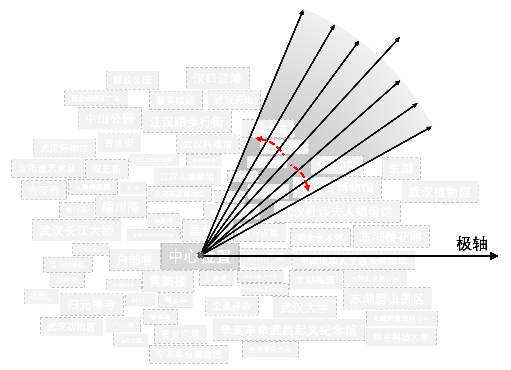

#### 2.2 多尺度标签云渲染

系统构建**多尺度模型**，支持兼顾全局与局部效应的中心型标签云预览漫游。其参照传统地图在应对尺度效应时采用的方法策略，具体指的是**层级结构设计思想**：通过在不同的层次上呈现标签，以应对不同的地理尺度；具体而言，在较大的尺度下减少标签数量，而在较小尺度下展示更为详细和精细的标签信息，以实现对标签云的自主探索与调整。

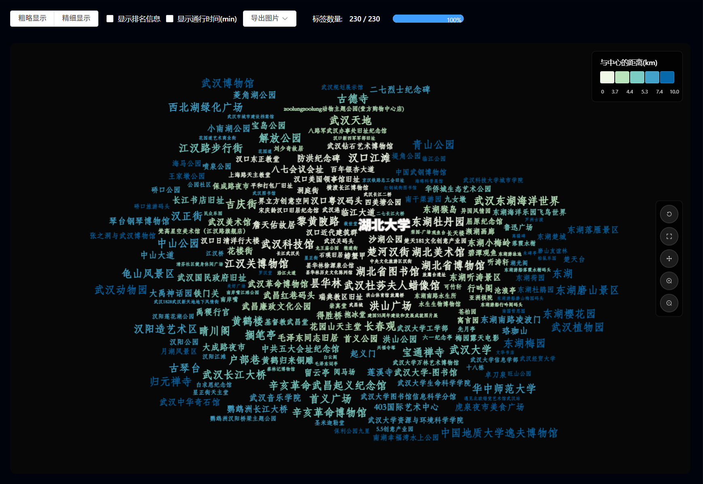

#### 2.3 实时可视化参数联动

系统采用 **Vue 3 Composition API + Pinia 状态管理** 架构，实现多面板参数的实时同步与标签云画布的即时渲染：

- **字体面板**：语言（中英文）、字体类别数量、字号梯度、字重、字体库
- **配色面板**：背景色、中心标签颜色、复色（色带）/ 单色切换、色带方案、配色数量、渲染方式（分位数、相等间隔、几何间隔、自然间断点、标准差等）
- **算法面板**：多角度径向移位、单角度径向移位、阿基米德螺线三种布局方式可选
- **数据管理**：地图框选与周边筛选、CSV 导入（替换当前会话数据）

所有参数修改均通过 Pinia Store 统一管理，确保多组件间的数据一致性。

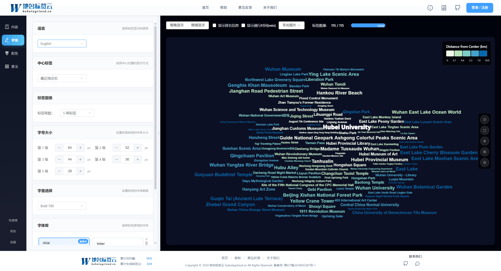

#### 2.4 高级可视化特性

- **动态排名与时间显示**：支持显示兴趣点在当前城市的排名，以及距离中心点的通行时间（通过高德 Web 驾车 API 动态获取）
- **标签交互**：鼠标悬浮高亮、点击查看详情、图例联动显示
- **画布操作**：返回中心位置、返回原始缩放、漫游、放大、缩小等交互功能
- **导出**：支持将当前标签云导出为 **PNG、JPEG 或 SVG**；位图导出前可指定宽高像素
- **移动端**：窄屏下地图与配置区以底部抽屉形式展开，标签云占据主可视区域；引导教程在移动端为简化步骤

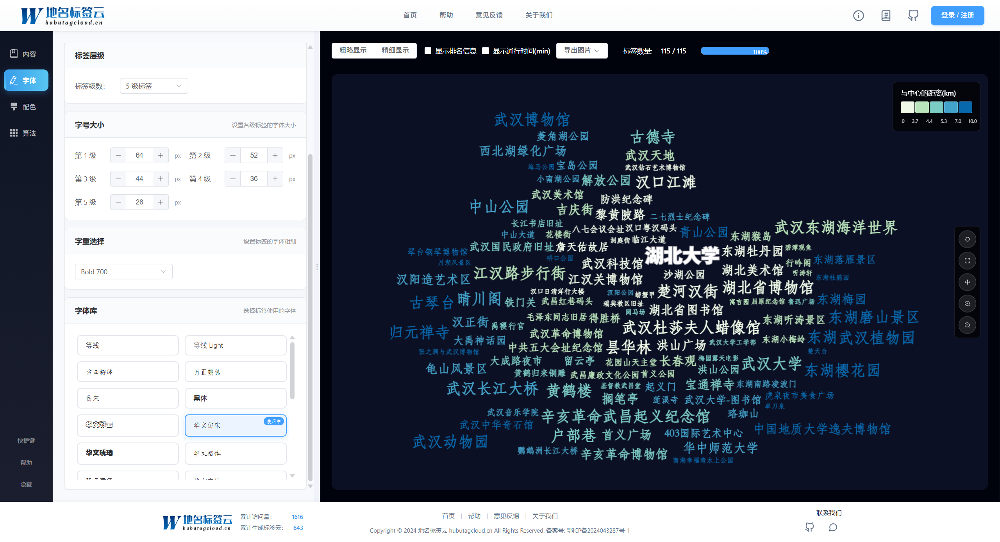

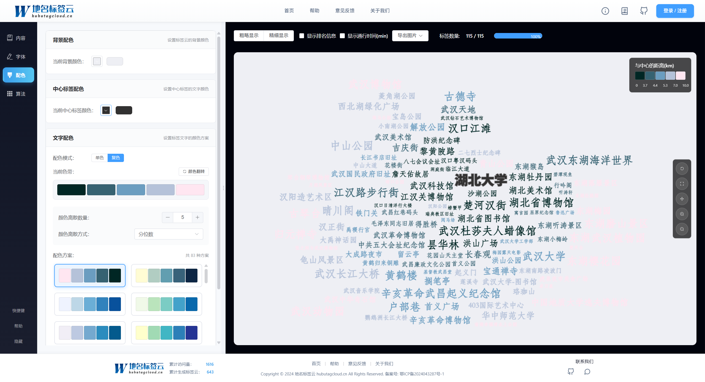

---

## 快速上手

最后更新时间：2026年3月29日

系统采用自 **地图与数据 → 可选导入 → 生成 → 字体 / 配色 / 算法 → 多尺度与导出** 的完整工作流。以下为推荐顺序（步数按桌面端主流程编排）。

### 1. **系统首页与界面导航**

桌面端：左侧为「内容、字体、配色、算法」导航，中间为地图与数据表，右侧为标签云。首次访问可通过 **Intro.js** 分步引导；引导内可勾选 **「最近不再默认显示此引导」**（写入浏览器本地存储）。

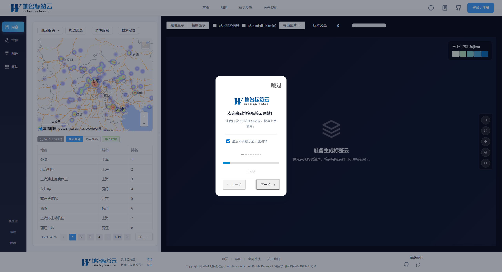

移动端：窄屏下地图与配置区以底部抽屉形式展开，标签云占据主可视区域；引导教程在移动端为简化步骤

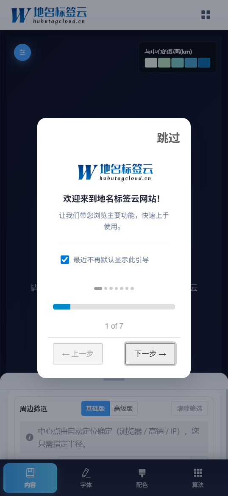

### 2. **查看兴趣点数据**

地图展示默认 POI（全国景点示例数据，自 `public/data/chinapoi.json` 加载）。支持 **点状 / 热力** 图层切换；地图 **右上角** 提供 **标准 / 卫星** 底图切换小控件。

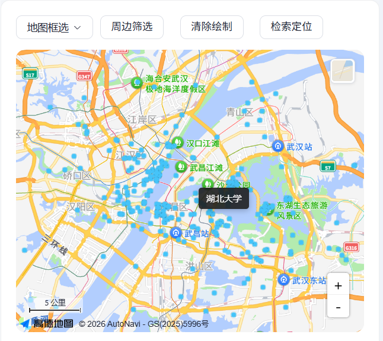

### 3. **兴趣点数据筛选**

- **地图框选**：在地图上绘制圆形、矩形或多边形，筛选落入区域内的 POI。
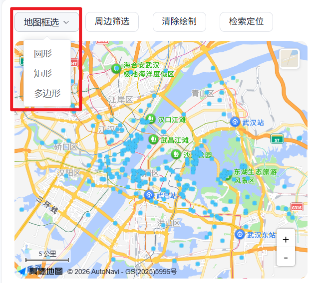

- **周边筛选**：打开「周边筛选」，在基础模式下使用自动定位中心 + 半径（及可选 POI 数量）；高级模式下可指定中心地名或经纬度。与框选互斥时以当前产品逻辑为准（已有绘制时周边入口会受限，具体见界面提示）。

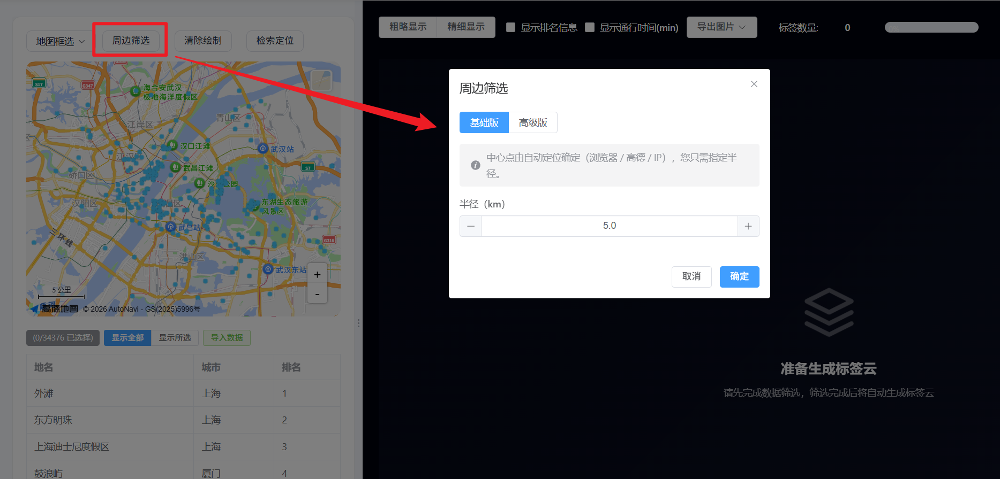

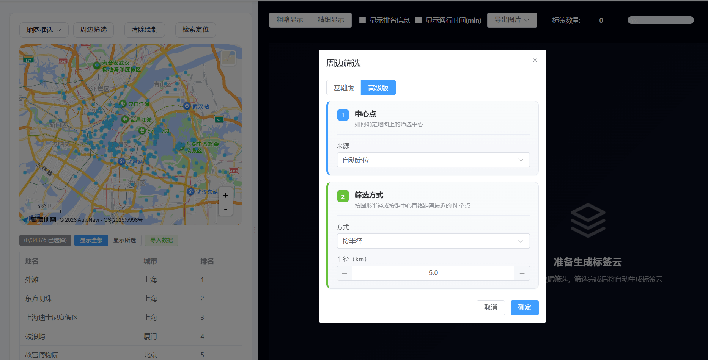  

- **检索定位**：按地名搜索并定位。

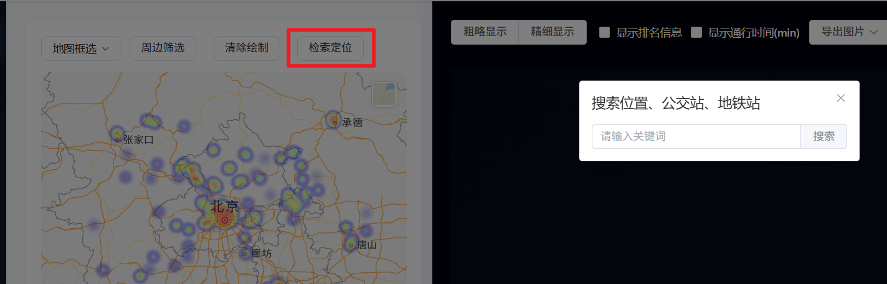  

### 4. **（可选）导入 CSV 数据**

在数据表工具栏打开 **「导入数据」**，选择 CSV 并完成列映射（地名、经度、纬度、可选城市、数值列等）。导入会 **替换当前浏览器会话内的 POI**；**刷新页面后恢复网站默认数据**。

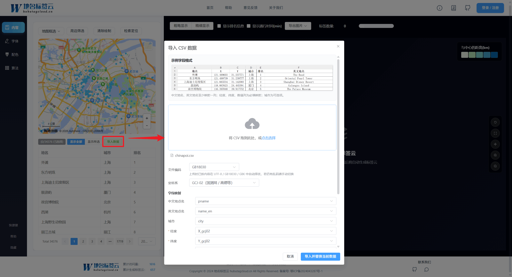

### 5. **生成地名标签云**

在完成数据筛选之后（地图框选或周旋筛选后），系统自动按当前权重列做分档，默认 **分位数** 等方式着色与字号映射，并按 **算法** 面板所选布局算法进行标签云的生成与排布。

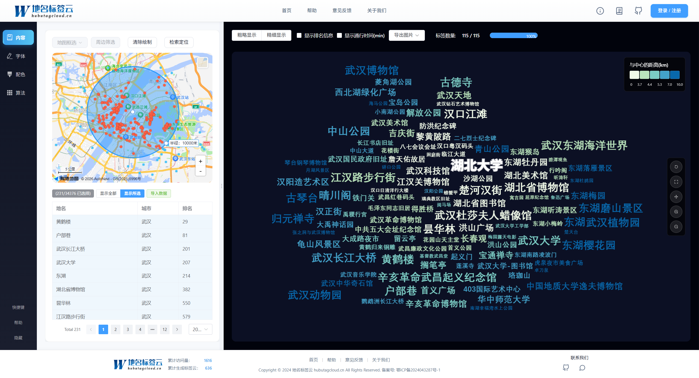

### 6. **字体与配色**

在**字体**栏目可以对当前的标签云的字体属性进行更改，包括**语言、字号、字重、字体**属性。其每一修改，将会对已绘制的地名标签云进行**实时更新**。

在**配色**栏目可以对当前的标签云的配色属性进行更改，包括**背景色、色带**。其中，**配色数量**即是将所有文本标签划分为几种颜色；而**渲染方式**即是包括**相等间隔**、**分位数**、**自然间断点**、**几何间隔**、**标准差**等符号渲染方式。其每一修改，将会对已绘制的地名标签云进行**实时更新**。

### 7. **算法**

在 **「算法」** 面板选择 **多角度径向移位 / 单角度径向移位 / 阿基米德螺线**，阅读面板内简要说明，切换选项后可直接重新生成标签云。
  
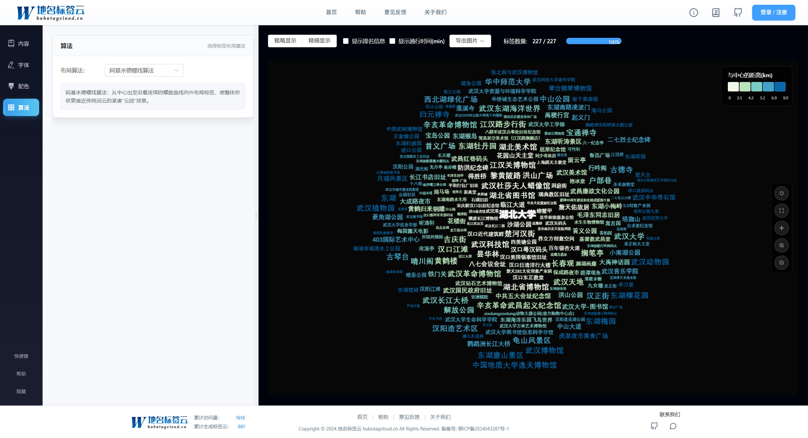

### 8. 图片导出

在标签云工具栏可 **导出 PNG、JPEG 或 SVG**。
  
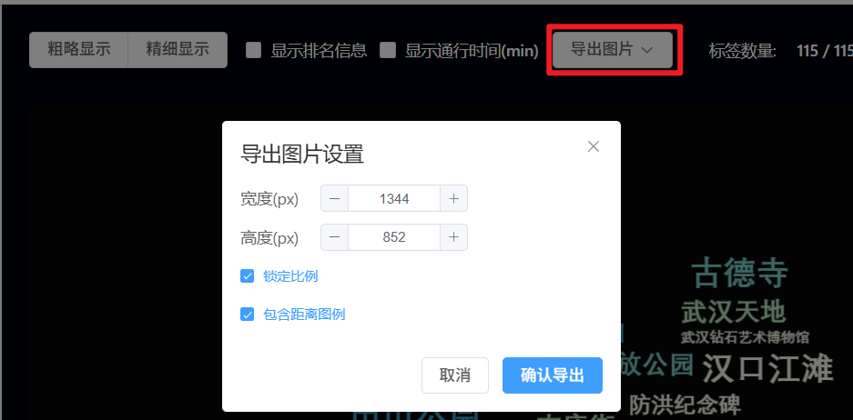

### 9. **帮助与反馈**

顶部导航可进入 **帮助**（即本文档）与 **意见反馈**；侧栏底部亦有 **帮助** 快捷入口。

---

## 入门教程

最后更新时间：2026年3月29日

### 一、功能面板详解

#### 1. 地图显示模块

地图工作区基于 **高德地图 JSAPI** 构建，提供丰富的地图交互能力：

- **POI点图层切换**：
  - **点状图层**：在大比例尺地图下，以点标记方式展示 POI 位置，适合精确查看点位信息
  - **热力图层**：在小比例尺地图下，根据 POI 密度生成热力图，适合展示区域热点分布

- **地图交互功能**：
  - **鼠标滚轮缩放**：支持鼠标滚轮对地图进行缩放操作
  - **鼠标拖拽**：支持鼠标拖拽实现地图漫游
  - **地点检索**：在检索框中输入地点名称，高德地图自动定位并缩放至该地点
  - **POI 悬浮提示**：当鼠标悬浮于某一景点 POI 上时，显示该景点的名称

- **地图工具**：
  - **放缩按钮**：提供地图缩放控制
  - **比例尺**：显示当前地图比例尺
  - **底图切换控件**：位于地图容器右上角，在标准电子地图与卫星影像之间切换。

.png "scale:50%")

#### 2. 数据管理模块

##### 2.1 数据显示

系统初始界面将会以**二维数据表**的形式展示当前系统存储的**兴趣点数据**，系统内默认存储的是全国的景点兴趣点数据。支持数据显示切换：

- **显示所有记录**：表格列出当前 POI 全集（或当前筛选结果全集，视数据状态而定）。
- **显示所选记录**：表格仅列出勾选的行，便于逐条查看。**注意**：此开关 **不** 改变标签云所用数据集合；当存在地图框选或周边筛选时，标签云仍以 **筛选得到的 POI** 为准。

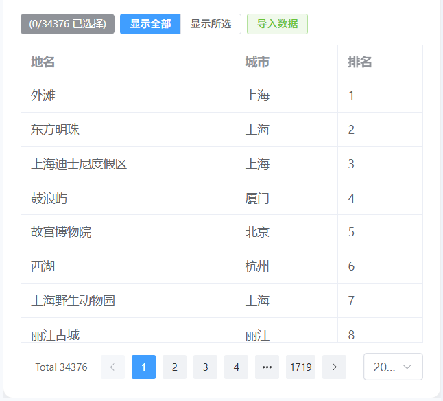

##### 2.2 数据导入（CSV）

在数据表工具栏点击 **「导入数据」**，选择 UTF-8 编码的 CSV 文件，按向导完成列映射：

- **必填**：地名（中文或英文列）、经度、纬度。
- **可选**：城市列、用于字号分级的数值列（如排名、热度等）；系统会根据列语义决定 **数值越大字越大** 或相反（与默认「排名」数据可能不同）。
- **效果**：导入成功后 **当前会话内** 全部 POI 被替换为文件内容；**刷新页面** 后恢复网站内置默认数据。
- **语言切换**：若 CSV 仅含中文地名或仅含英文地名，「字体」中的 **语言切换** 可能被禁用，以避免无字段可用。

##### 2.3 数据筛选

系统目前支持两类 POI 数据筛选方式，包括 **地图框选**与**周边筛选**。

**地图框选**：支持绘制面状覆盖物以进行数据的筛选：
- **圆形覆盖物**：以圆心和半径定义圆形区域
- **矩形覆盖物**：以对角两点定义矩形区域
- **多边形覆盖物**：以多个顶点定义任意多边形区域

**周边筛选**：以某中心点为圆心、给定半径（千米）筛选 POI；基础模式依赖 **浏览器 / 高德 / IP** 多级自动定位，高级模式可 **手动输入地名或经纬度**（当自动定位均失败时建议使用）。

同时也支持用户通过**清除绘制**将所有的覆盖物与已筛选数据进行清除。

#### 3. 标签云生成模块

##### 3.1 生成标签云

用户在地图显示模块进行数据筛选之后，单击**运行生成标签云**，系统将会对用户所框选的兴趣点数据进行筛选，并采用**分位数法**对其字号、颜色进行设置，接着使用内置的**压盖检测与多角度径向偏移策略**绘制不重叠且基本无偏的地名标签云。

本系统基于**Fabric.js**相关接口，复用其对象模型与事件机制，创新性地构建**文本标签的多角度径向移位算法**，其中包括**自适应范围扫描**、**最优步长偏移**等步骤。通过这些算法，在保证局部单一标签尽量无偏的前提下，完成了**全局无压盖的标签云绘制**。

在已绘制的标签云中，系统采用了**色带属性**来表示各标签距离中心位置的远近，并利用**字体大小**来表征地点的重要性或优劣程度。这种绘制方式旨在提高标签云的可视化效果，使得用户能够更直观地理解标签的空间分布和相对重要性。

##### 3.2 添加排名与时间

在用户单击**显示排名信息**或是**显示通行时间(min)**之后，将会动态在各标签后面添加显示该兴趣点在当前城市的排名或是距离中心点的通行时间，其中通行时间是通过**高德Web驾车API**进行动态获取。

- 显示排名

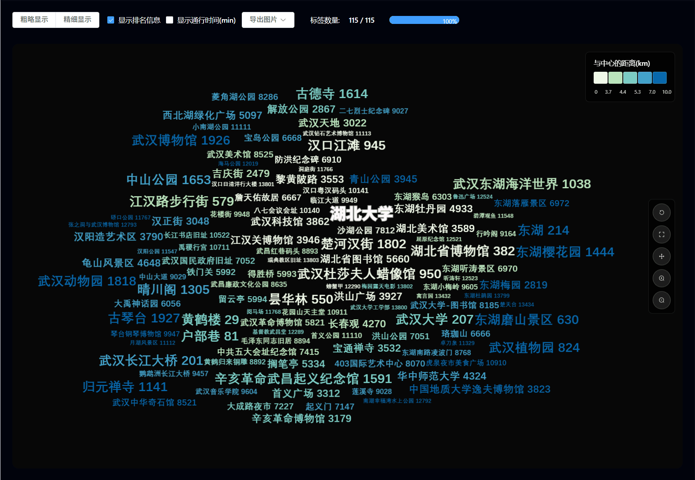

- 显示与中心地点的通行时间

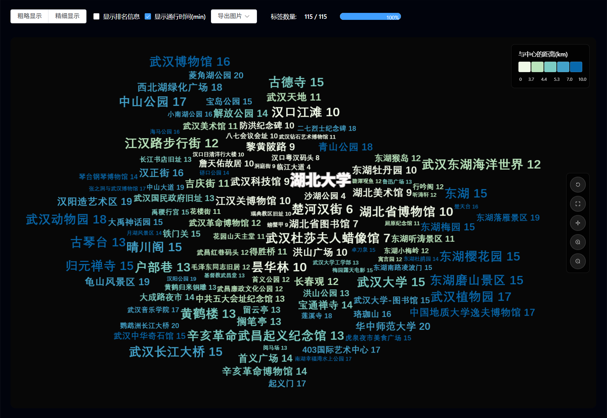

-显示排名与通行时间

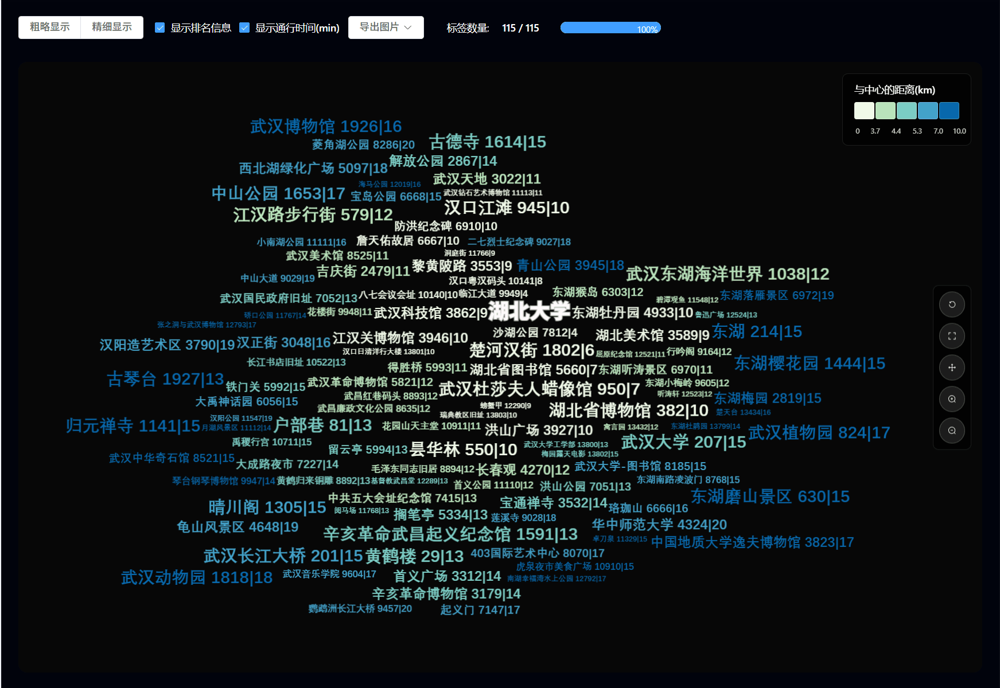

##### 3.3 多尺度效应

用户可以通过单击**精细显示**与**粗略显示**，调用**地理多尺度模型**对展示在图层上的标签数量进行增减。

系统构建的**多尺度模型**，支持兼顾全局与局部效应的中心型标签云预览漫游。其参照传统地图在应对尺度效应时采用的方法策略，具体指的是**层级结构设计思想**：通过在不同的层次上呈现标签，以应对不同的地理尺度；具体而言，在较大的尺度下减少标签数量，而在较小尺度下展示更为详细和精细的标签信息，以实现对标签云的自主探索与调整。

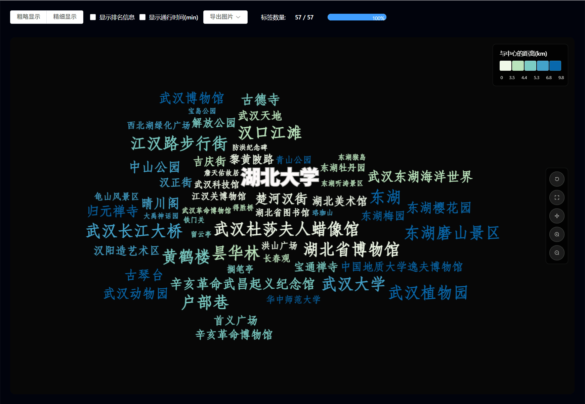

#### 4. 字体交互模块

系统可单击左侧导航栏**字体**切换至**字体改变交互模块**。在此模块下，用户可以对**标签语言**、**字体类别数量**、**字号大小**、**字重**、**字体**进行修改。其每一修改，将会对已绘制的地名标签云进行**实时更新**。

- **标签语言**：切换所生成的标签云的语言，目前支持中文/英文切换

- **字体类别数量**：将标签按照权重划分为多个类别，每个类别使用不同的字号

- **字号大小**：为每个类别设置字号范围，系统根据权重在范围内线性映射

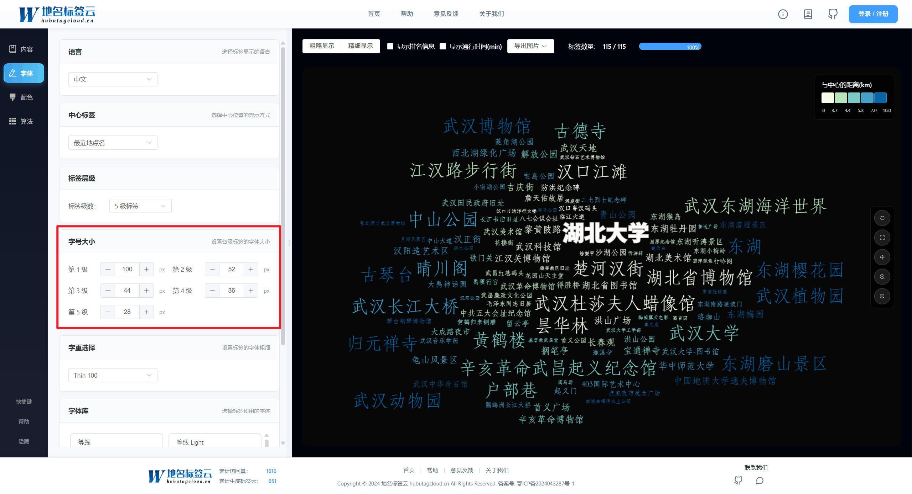

- **字重**：设置标签的字体粗细（100-900），影响标签的视觉突出程度

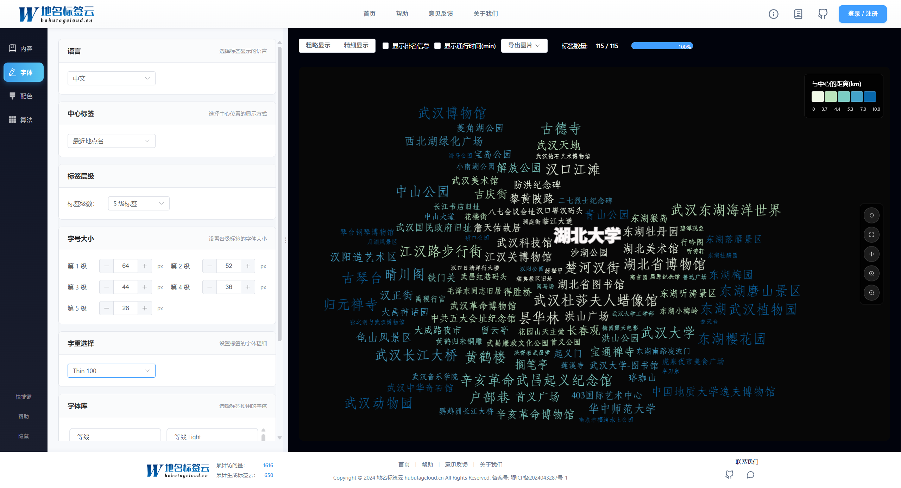

- **字体**：选择标签使用的字体族（中文字体、英文字体）

#### 5. 配色交互模块

系统可单击左侧导航栏**配色**切换至**配色改变交互模块**。在此模块下，用户可以对**标签云背景**、**色带**、**配色数量**、**渲染方式**进行修改。其中，**配色数量**即是将所有文本标签划分为几种颜色；而**渲染方式**即是包括**相等间隔**、**分位数**、**自然间断点**、**几何间隔**、**标准差**等符号渲染方式。其每一修改，将会对已绘制的地名标签云进行**实时更新**。

- **背景色**：标签云画布背景。
- **中心标签颜色**：单独设置位于中心位置的文字颜色（与周缘标签的色带或单色方案独立）。
- **文字配色模式**：
  - **复色（色带）**：从预设色带中选方案，配合 **配色数量** 与 **渲染方式** 做分级着色；色带在界面上按 **由浅到深** 顺序展示；变更配色档数时会尽量保持当前选中的色带方案索引。
  - **单色**：关闭色带分级，全部周缘标签使用同一颜色（适合简洁海报风）。
- **色带配置**：预设多种配色，可在色带上自定义节点颜色。
- **配色数量**：分几档显示颜色（与数值离散结果联动）。
- **渲染方式**：
  - **分位数**、**相等间隔**、**几何间隔**、**自然间断点**、**标准差**：含义与 GIS 中常见分级方法一致，按数据分布特点选用。

#### 6. 其余交互功能

- **图例高亮**：在用户鼠标悬浮至某一**图例**上时，将会动态将对应类别的标签进行**高亮显示**。

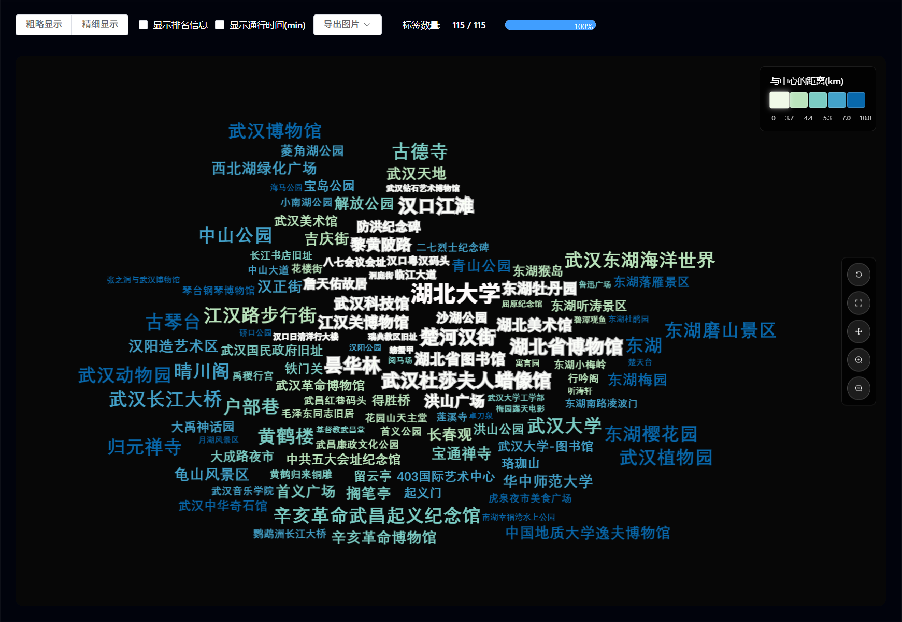

- **标签详情**：在用户单击某一标签后，将会调用**地点详情信息窗口**，在其上展示该景点的**地点名**、**经纬度**、**与中心点之间的距离**、**在该城市的排名**等信息。

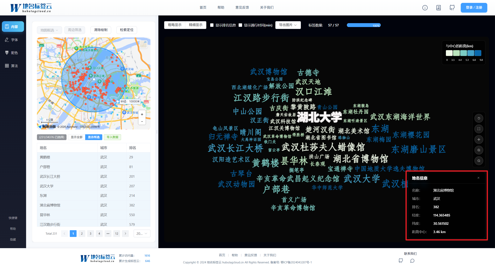

- **画布操作**：在系统窗口右侧还存在一竖排功能栏，具体包括**返回中心位置**、**返回原始缩放**、**漫游**、**放大**、**缩小**，用户可通过这一系列功能进行交互操作。

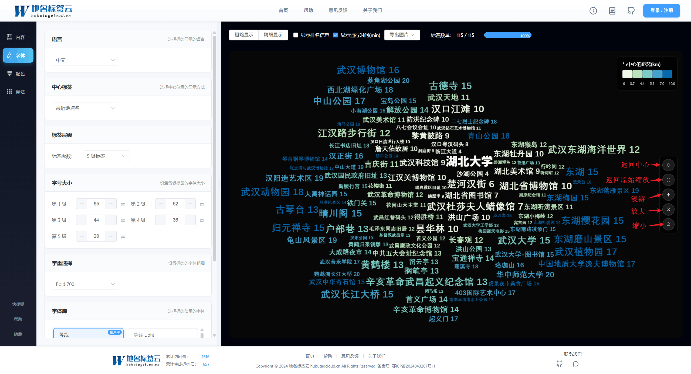

#### 7. 算法面板

在侧栏选择 **「算法」**，从下拉框中选择布局方式。更改算法可自动直接看到布局变化。面板内附有与实现对齐的简短说明文案。

- **多角度径向移位算法**：在真实方位角附近 ±15° 扇区内搜索可放置位置，兼顾径向与切向避让。

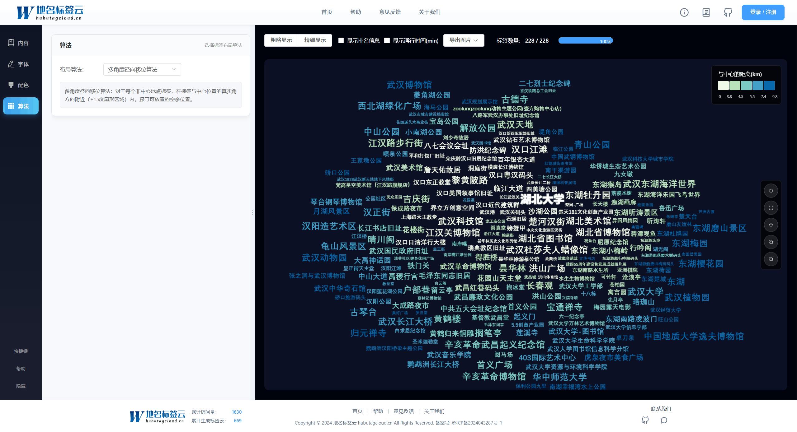

- **单角度径向移位算法**：沿与中心连线方向径向外推寻找空位，计算更简单、排布更呈放射状。

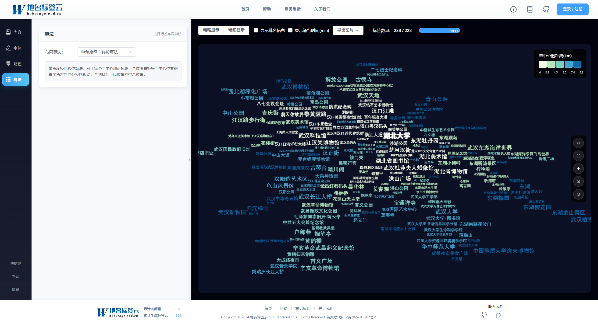

- **阿基米德螺线算法**：沿螺线由中心向外展开，整体轮廓更接近传统词云「云团」。

#### 8. 导出与访问统计

- **导出图片**：在标签云工具栏中打开 **「导出图片」**，可选择 **SVG**（矢量）或 **PNG / JPEG**（位图）。位图支持在对话框中指定导出 **宽度、高度**（像素），确认后浏览器下载文件。
- **访问统计（可选）**：若部署时配置了环境变量 `VITE_STATS_API_URL` 并对接 `stats-backend` 等服务，页脚可能展示累计访问等数据；未配置或接口失败时不影响主流程（仅无统计或显示为占位）。

#### 9. 移动端布局

在 **窄屏**（如手机竖屏）下，界面策略与桌面不同：

- **标签云**占据主可视区域上方大部分空间，便于预览成果。
- **地图、数据表、字体、配色、算法** 等内容集中在 **底部抽屉**：通过拖动抽屉顶部 **把手** 调整露出高度，可上滑至接近全屏以操作地图与表格。
- **标签云工具**（粗略/精细、排名/时间、导出等）在移动端以 **悬浮按钮 / 折叠菜单** 形式提供，避免挤占画布。
- **Intro.js 引导**：移动端步骤与桌面不同，侧重顶部菜单、底栏四个主面板入口；仍支持 **「最近不再默认显示此引导」**。

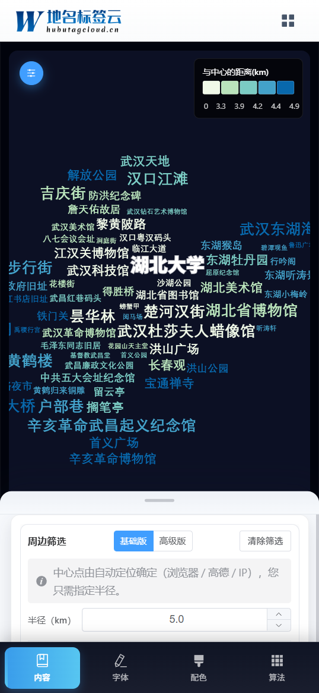

### 二、常见问题与故障排除

#### 1. 标签云生成失败

**问题描述**：点击"运行生成标签云"后，画布上没有显示标签。

**可能原因与解决方案**：
- **数据筛选为空**：没有在地图上绘制筛选区域或周边筛选范围内没有 POI 数据
  - **解决方案**：扩大筛选范围、调整周边半径，或改用框选区域包含点位
- **误以为是表格「显示所选」导致**：若仅切换了表格显示模式而未做地图筛选，标签云仍可能使用全部或上次筛选结果
  - **解决方案**：查看地图是否仍有高亮筛选区域；必要时 **清除绘制** 后重新筛选

#### 2. 地图加载失败

**问题描述**：地图无法正常显示或加载。

**可能原因与解决方案**：
- **网络连接问题**：无法访问高德地图 API
  - **解决方案**：检查网络连接，确保可以访问高德地图服务
- **API Key 配置错误**：高德地图 API Key 配置不正确
  - **解决方案**：检查 `PoiMap.vue` 中的 Key，并在高德控制台核对 **安全密钥（jscode）** 与 **Referer 白名单**

#### 3. 自动定位失败（周边筛选）

**问题描述**：周边筛选提示无法获取当前位置。

**可能原因与解决方案**：
- 浏览器未授予定位权限，或 HTTPS / localhost 限制
- 高德 / IP 定位服务暂时不可用  
**解决方案**：在周边筛选 **高级模式** 中手动输入中心地名或经纬度；或改用地图 **框选** 筛选。

#### 4. CSV 导入失败或列识别不对

**问题描述**：导入报错或地图/表格字段异常。

**可能原因与解决方案**：
- 文件编码不是 UTF-8、分隔符或表头与映射不一致  
**解决方案**：用 Excel / 记事本另存为 UTF-8 CSV，并在导入向导中逐列对应 **地名、经度、纬度**；数值列选对「排名/热度」语义。

### 三、应用案例与最佳实践

#### 案例1：旅游景点分析与推荐

**应用场景**：旅游规划、景点推荐、旅游路线分析

**操作流程**：
1. 在地图上绘制或选择目标区域（如某个城市或景区范围）
2. 系统自动筛选该区域内的景点 POI 数据
3. 根据景点评分或热度设置权重，实现字号分级
4. 调整配色方案，使用暖色调突出旅游主题
5. 使用"精细显示"模式查看详细景点信息
6. 点击标签查看景点详情，辅助旅游决策

#### 案例2：区域热点识别与分析

**应用场景**：商业分析、市场研究、区域规划

**操作流程**：
1. 导入自定义行业数据集（如连锁门店、产业园区等）
2. 根据业务指标（如门店数量、销售额等）设置权重
3. 使用"粗略显示"模式查看整体分布
4. 使用"精细显示"模式查看局部热点
5. 分析区域热点与覆盖空白，为业务决策提供数据支持

#### 案例3：地理教学演示与可视化

**应用场景**：地理教学、空间分析教学、数据可视化教学

**操作流程**：
1. 选择典型的地理区域案例（如某个城市、某个景区）
2. 系统自动识别并展示相关地理信息
3. 采用学术风格的配色方案（低饱和度、高对比度）
4. 使用多尺度模型展示不同层次的地理信息
5. 通过标签交互功能，深入探索地理空间数据

---

## 技术文档与参考资料

最后更新时间：2026年3月29日

### 1. 官方文档

- [概述/快速上手/入门教程（PDF 合集）]()（待更新）

### 2. 技术参考

- **Fabric.js 官方文档**：[https://fabricjs.com/](https://fabricjs.com/)
- **Vue 3 官方文档**：[https://cn.vuejs.org/](https://cn.vuejs.org/)
- **Pinia 状态管理文档**：[https://pinia.vuejs.org/zh/](https://pinia.vuejs.org/zh/)
- **Element Plus 组件库文档**：[https://element-plus.org/zh-CN/](https://element-plus.org/zh-CN/)
- **高德地图 JSAPI 文档**：[https://lbs.amap.com/api/javascript-api/summary](https://lbs.amap.com/api/javascript-api/summary)
- **Vite 构建工具文档**：[https://cn.vitejs.dev/](https://cn.vitejs.dev/)

### 3. 学术论文与理论参考

- **中心型标签云**：
  - [以用户地理位置为中心的兴趣点标签云 (成晓强 et al.,2024)](https://d.wanfangdata.com.cn/periodical/dqxxkx202401009)
  - [Lbs tag cloud: a centralized tag cloud for visualization of points of interest in location-based services (Cheng Xiaoqiang et al.,2023)](https://www.mdpi.com/2220-9964/12/9/360)
- **标签云布局算法**：
  - [Wordle: Creating Word Clouds (Viegas et al., 2009)](https://hci.stanford.edu/cstr/reports/2009-03.pdf)
  - [Tag Clouds and the Case for Vernacular Visualization (Rivadeneira et al., 2007)](https://www.researchgate.net/publication/220195182_Tag_Clouds_and_the_Case_for_Vernacular_Visualization)
- **多尺度可视化**：
  - [Multi-Scale Visualization of Large Spatial Datasets (Zhou et al., 2010)](https://ieeexplore.ieee.org/document/5453102)

---

## 视频教程专区

最后更新时间：2026年3月29日

### 1. 基础教程

- **系统概述与快速上手**（筹备中）
  - 系统功能介绍
  - 界面布局说明
  - 快速生成第一个标签云

- **数据管理与筛选**（筹备中）
  - 数据查看与编辑
  - 数据导入操作
  - 地图数据筛选

### 2. 进阶教程

- **标签云生成与优化**（筹备中）
  - 多角度径向移位算法原理
  - 标签云生成流程
  - 多尺度模型使用

- **可视化参数调优实战**（筹备中）
  - 字体分级与权重映射
  - 配色方案设计
  - 实时参数联动

### 3. 应用案例

- **旅游景点分析案例**（筹备中）
- **区域热点识别案例**（筹备中）
- **地理教学演示案例**（筹备中）

*更多演示视频，后续持续更新*

---

## 技术支持与社区

最后更新时间：2026年3月29日

### 1. 项目资源

- **在线演示**：[https://www.hubutagcloud.cn/](https://www.hubutagcloud.cn/)
- **GitHub 仓库**：访问项目 [Github](https://github.com/1937983507/fabricTagCloud4) 仓库获取源代码和问题反馈

### 2. 问题反馈与技术支持

- **问题反馈**：
  - 在 [Github](https://github.com/1937983507/fabricTagCloud4) 提交反馈，详细描述问题现象、复现步骤和预期行为
  - 发送邮件至项目维护团队（1937983507@qq.com），主题注明 "fabricTagCloud4 问题反馈"

- **功能建议**：
  - 在项目主页提交功能建议，描述功能需求和使用场景
  - 发送邮件至项目维护团队，主题注明 "fabricTagCloud4 功能建议"

- **技术支持**：
  - 如需行业定制、技术咨询或深度技术支持，欢迎联系项目维护团队
  - 我们将在 3-5 个工作日内回复您的咨询

### 3. 贡献与参与

我们欢迎社区贡献，包括但不限于：
- **代码贡献**：提交 Pull Request，改进功能或修复 Bug
- **文档完善**：改进用户手册、添加使用案例、翻译文档
- **测试反馈**：测试新功能、报告 Bug、提供使用反馈
- **功能扩展**：开发插件、扩展算法、集成第三方服务

### 4. 开发团队

本项目由 **湖北大学制图组** 开发维护，团队研究方向包括：
- **时空大数据可视化**：利用大数据技术与可视化方法，将地理信息、兴趣点数据与空间分析结果以直观方式呈现
- **泛地图学理论与方法**：探索新型地图可视化方法，包括隐喻地图和创新可视化技术

更多团队信息请访问：[湖北大学制图组官网](https://www.hubutagcloud.cn/cxq-group/)

---

## 版本更新日志

最后更新时间：2026年3月29日

### 2026-04-06

1. 移动端下添加全屏展示按钮
2. 移动端下添加横屏展示按钮，并修复漫游与放缩事件。

### 2026-03-29

1. 将地图切换能力抽离为独立小控件，置于地图窗口右上角。
2. 优化标签云窗口右侧工具区说明文字的加载速度。
3. 调整主视图样式，使界面在移动端也能良好展示。
4. 修复「显示全部 / 显示所选」仅与表格数据联动、未与标签云控件正确联动的问题。

### 2026-03-28

1. 将色带顺序调整为自浅至深。
2. 在颜色离散数量变更时，保持当前选中的色带不变。
3. 移除表格数据中的无用功能。
4. 新增数据导入模块。
5. 鼠标悬浮于地点上时显示地名。
6. 将「定位检索」与「清除筛选」抽离为独立控件，并扩展定位筛选（中心地点、半径、POI 数量等）。

### 2026-03-17

1. 在文字配色中增加单色切换功能。

### 2026-03-16

1. 修复算法切换过程中存在的问题。
2. 在算法中增加阿基米德螺线布局。
3. 更新 README，补充 TODO 说明。
4. 在配色窗口增加「中心标签」子模块，支持单独修改中心标签颜色。

### 2026-02-01

1. 修复「显示累计生成标签云」相关显示问题。

### 2026-01-31

1. 优化多角度径向移位算法的运行性能。
2. 新增算法窗口，支持在「单角度」与「多角度径向移位」之间切换。

### 2025-12-25

1. 增加网页访问人数的渲染与展示。

### 2025-12-23

1. 优化词云算法效率。

### 2025-12-22

1. 新增定位搜索：以用户所在位置为圆心，绘制指定半径（km）范围。
2. 增加兜底策略：当自动定位均不可用时，支持手动输入地点或经纬度。
3. 使用空间索引优化词云生成速率。
4. 优化词云生成速度。
5. 优化词云算法。
6. 增加限定角度的螺旋布局算法。
7. 增加生成过程进度条展示。

### 2025-12-21

1. 优化图例，在色块之间增加数字标签。
2. 将「中间位置」统一为「中心位置」表述。
3. 支持用距中心最近的标签替代中心位置。
4. 优化「获取距中心最近地点」相关逻辑。

### 2025-12-07

1. 压缩 JSON 数据，缩短前端获取数据的响应时间。
2. 数据未加载完成时在地图上显示遮罩，提示加载中。
3. 在引导窗口增加「近期不再显示引导」复选框。
4. 修复引导窗口中复选框状态切换异常。

### 2025-12-06

1. 将引导教程移至右上角，子页面不再显示。
2. 优化 Logo 图标。
3. 调整帮助页面。
4. 新增中英文界面切换。
5. 精简字体窗口，保留单一字体库。
6. 替换 Logo。
7. 优化导出图片，支持可选格式。
8. 完善帮助文档。
9. 压缩帮助文档配图。
10. 将 CSV 转为 JSON 并启用 Gzip 压缩。
11. 修订帮助文档。
12. 更新 README。

### 2025-12-03

1. 修正相关上线链接。

### 2025-11-23

1. 优化引导窗口样式。
2. 优化标签云生成算法，使字号分级更准确。
3. 优化标签云渲染，支持更新颜色与字体。
4. 优化地图覆盖物，并支持修改覆盖物。
5. 新增信息展示窗口。
6. 更新浏览器标签页图标。
7. 修正页面路由路径。
8. 更新 README 文档。

### 2025-11-22

1. 初始构建首页。
2. 新增字体与配色模块。
3. 新增 POI 金字塔与 Canvas 交互。
4. 修复多角度径向移位算法及 POI 金字塔相关问题。
5. 修复地图覆盖物绘制及 POI 金字塔相关问题。
6. 优化排名与通行时间的展示。
7. 优化初始界面。
8. 扩展更多预设色带。
9. 优化整体样式。
10. 调整页脚样式。
11. 新增引导语。
12. 新增页面引导。
13. 优化页头，移除无用按钮。
14. 新增帮助页面。
15. 删除示例数据。
16. 修复帮助页面样式。
17. 新增反馈页面。
18. 优化引导语窗口宽度。

### 2025-11-21

1. 项目架构搭建。

---

## 附录

### A. 系统要求

- **浏览器**：Chrome 90+、Firefox 88+、Edge 90+、Safari 14+（推荐使用 Chrome）
- **屏幕分辨率**：建议 1920×1080 或更高
- **网络环境**：需要访问高德地图 API，建议稳定的网络连接

### B. 数据格式说明

- **POI 数据格式**（CSV）：
  - 必需字段：地名、经度、纬度
  - 可选字段：城市、排名、全国排名、自定义权重
  - 编码格式：UTF-8 或 GBK
  - 分隔符：逗号（,）或制表符（\t）

- **坐标系说明**：
  - 支持 WGS84（EPSG:4326）和 GCJ02（高德坐标系）
  - 系统会自动进行坐标系转换

### C. 常见术语表

- **POI**：Point of Interest，兴趣点，指地图上的地点信息
- **中心型标签云**：以某一地理位置为中心，将标签环绕中心摆放的标签云布局方式
- **多角度径向移位算法**：通过多角度扫描和径向偏移，实现标签无压盖布局的算法
- **多尺度模型**：在不同地理尺度下展示不同详细程度的标签信息的模型
- **权重映射**：将数据值映射到视觉属性（如字号、颜色）的过程
- **色带**：用于表示数据分级的颜色渐变方案
